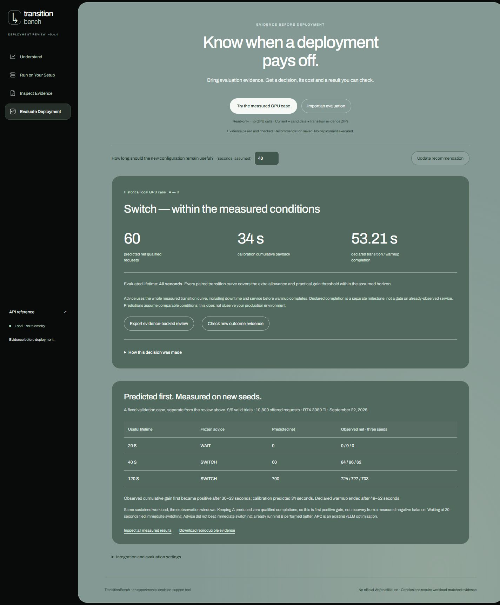

# TransitionBench

**Review an inference deployment before trusting its headline speedup.**

TransitionBench is an early developer tool for evaluating inference configuration changes. It uses matched current, candidate, and actual-transition measurements to estimate cumulative **SLO-qualified completions** over an explicit time horizon. It saves the estimate, then checks later matched measurements against it.

The analysis workflow is read-only: your serving system keeps deployment authority. The included recorded case runs without a GPU, a provider key, or access to anyone's private infrastructure.

**[Install v0.4.4](https://github.com/Kakarottoooo/TransitionBench/releases/tag/v0.4.4)** · **[Five-minute walkthrough](docs/engineer-review.md)** · **[Connect request logs](docs/external-logs.md)** · **[中文](README.zh-CN.md)**



## Try it locally

Use Python 3.11–3.13, preferably in a fresh virtual environment:

```sh
python -m pip install https://github.com/Kakarottoooo/TransitionBench/releases/download/v0.4.4/transitionbench-0.4.4-py3-none-any.whl
transitionbench serve --port 8765 --data-dir .transitionbench
```

Open **http://127.0.0.1:8765/?view=deployment** and select **Try the measured GPU case**. Nine real calibration bundles are included. Import, pairing, evidence checks and calculations run locally. Changing the assumed useful lifetime recomputes a conditional recommendation; it does not change the recorded independent test results.

The other application views include simulation and separately authorized execution capabilities. The deployment-review walkthrough neither runs a model nor deploys a configuration. The service binds to loopback; this is not a hosted multi-tenant SaaS.

**Evidence freshness is enforced.** The sample was measured on September 22, 2026. Its interactive review allows a maximum age of 30 days; after that, new advice is correctly refused. Dates are never refreshed to make old measurements look current. The recorded test table and independent arithmetic verification below remain usable. For a real decision, import fresh matched measurements.

## What the real case demonstrates

An earlier evaluator treated “warm-up complete” as a hard gate on useful service. The corrected evaluator counts the complete transition curve, including service delivered before that marker.

In three held-out matched trials on one RTX 3080 Ti, enabling vLLM's existing prefix caching produced:

| Horizon after switch trigger | Frozen prediction: switch minus keep | Observed net completions, three seeds |
|---|---:|---:|
| 20 seconds | 0 — WAIT | 0 / 0 / 0 |
| 40 seconds | 60 — SWITCH | 84 / 86 / 62 |
| 120 seconds | 700 — SWITCH | 724 / 727 / 703 |

Declared warm-up completion occurred after approximately 49–52 seconds, so the 40-second gains matter to the accounting correction. The keep baseline had **zero qualified completions** in this case. Its first positive cumulative crossing is not repayment of a preceding negative balance; a percentage improvement over that baseline would be misleading. WAIT at 20 seconds did not demonstrate avoided loss. Immediate switching tied the review's chosen actions in this case.

A separate 36-trial study found that immediate switching beat a more complicated cost-aware rule under sustained repeated-prefix traffic. Later state-aware studies did **not** establish an advantage over strong simple baselines. See [results and boundaries](docs/results.md), including the latest negative capacity screen and mechanism review.

APC is a vLLM optimization, not an invention of TransitionBench. These are synthetic workloads and scoped measurements, not Wafer production results.

## Verify the numbers without installing the application

Download [the sealed evidence ZIP](https://github.com/Kakarottoooo/TransitionBench/releases/download/v0.4.4/TransitionBench-prospective-v4-evidence.zip) and [the standalone verifier](https://github.com/Kakarottoooo/TransitionBench/releases/download/v0.4.4/verify_prospective_v4.py) into the same directory:

```sh
python verify_prospective_v4.py TransitionBench-prospective-v4-evidence.zip verified-v4
```

Only Python's standard library is required. `verified-v4` must be new. The verifier checks the sealed archive and its 346 members, recomputes all nine trials from raw requests, verifies the frozen forecasts, and checks nine seed/window outcomes. It writes `verified-v4/verification.json`. This checks recorded arithmetic and integrity; it is not an independent GPU rerun or hardware attestation.

Archive SHA256:

```text
d445b19c1b7b9e9dff384a442d8697ce9bc57dd9be181b25512cdea278158849
```

## Connect an existing evaluator

```text
Current / candidate / actual transition measurements
    → import and validate evidence
    → review a caller-specified horizon
    → save forecast and assumptions
    → observe independent matched evidence
    → inspect prediction error or incompatibility
```

- **Native evidence:** [HTTP, Python and CLI review contract](docs/deployment-review.md).
- **Existing logs:** [explicit JSONL reference adapter](docs/external-logs.md). It requires timestamps, quality/SLO data and run metadata; it does not guess missing fields.
- **API:** [OpenAPI](docs/openapi.json), [other interfaces](docs/integration.md), [security boundaries](docs/security.md).

The initial review model supports a homogeneous workload, a measured restart, and at least three matched calibration seeds. It rejects unsupported horizons or incompatible evidence. Caller-supplied useful lifetime is an assumption, not a prediction of future demand.

## Develop

The built frontend is included in the wheel and source tree; Node is only needed when editing the UI.

```sh
python -m pip install -e . pytest pytest-asyncio
python -m pytest -m cpu tests
```

To rebuild the frontend, run `npm ci` and `npm run build` in `web/`. Vite writes the packaged assets to `src/transitionbench/static/`. The TypeScript SDK lives in `sdk/`.

## Scope

Delivered: installable software, a local web application, explicit evidence interfaces, a measured accounting correction, and independently recomputable records. Not established: general policy superiority, production reliability, Wafer adoption or integration, or completion of the original broad multi-GPU research plan.

The public release is curated for review. The sealed historical archive is kept unchanged, including original technical path strings and negative outcomes. It contains synthetic benchmark payloads, not customer requests. Private billing records, credentials, environments, weights and unrelated diagnostic workspace files are excluded.
